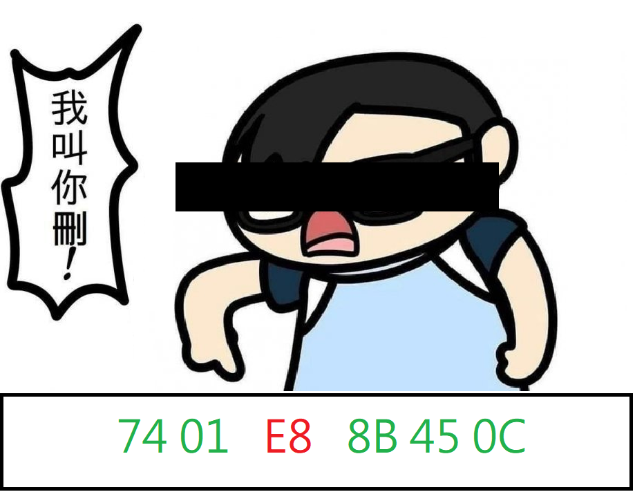

# Rogue Byte Killer

# what's this?
a easy ida plugin to kill rogue bytes, based on your emulation result
# requirements
* [mandiant/speakeasy](https://github.com/mandiant/speakeasy)
* ida python 3
# usage
1. load the script into ida
2. select the range by mouse or directly enter it
3. provide command line option (optional)
4. run and enjoy the result :D

# credit
* [主廚](https://wall.gamer.com.tw/user.php?userId=joanna890508) for providing asset for logo
